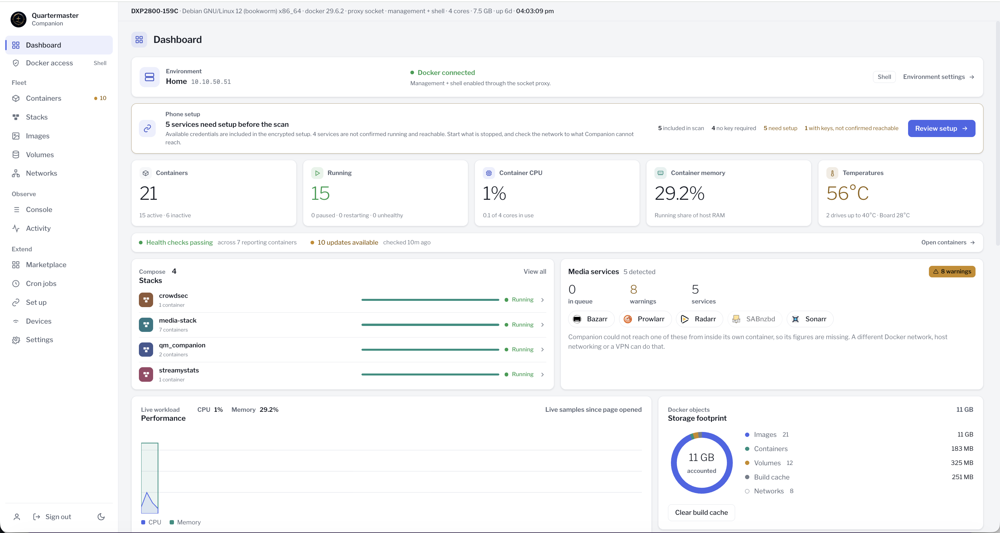
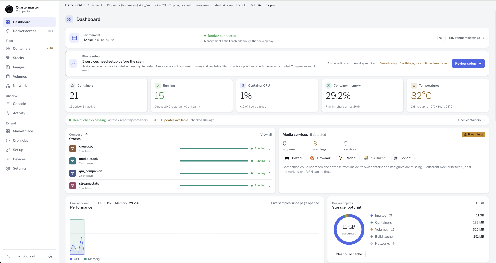
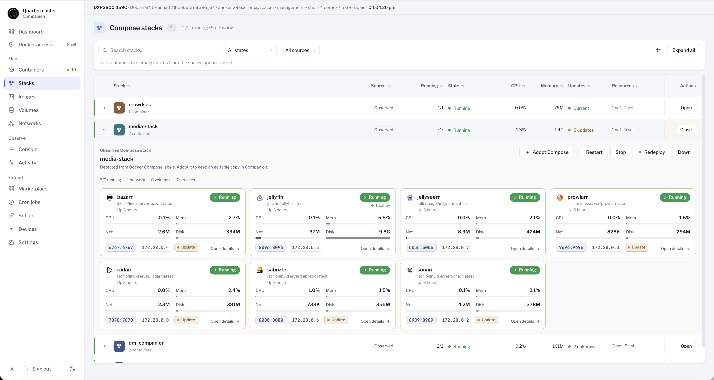

# Quartermaster Companion

Quartermaster Companion is a self-hosted web application for the Quartermaster phone app. It discovers supported services, prepares encrypted one-time setup transfers, and provides an authenticated view of Docker and service status.

The standard setup transfer does not route app traffic through Companion. After setup, Quartermaster connects directly to the local and away addresses saved for each service. An optional mobile profile adds a persistent, certificate-pinned HTTPS connection for Companion's Docker overview.

## Features

- Discovers multiple service instances from approved config files and Docker.
- Transfers service addresses and API keys through a shorttlived encrypted setup package.
- Shows containers, stacks, images, volumes, networks, events, logs, and resource use.
- Provides optional Docker lifecycle controls, image operations, Compose deployment, scheduled jobs, and an in-container shell.
- Stores credentials in authenticated encrypted state.
- Supports one owner account, two-factor authentication, session revocation, and recovery codes.
- Runs without telemetry or a hosted account dependency.

## Screenshots



| Live monitoring | Compose stacks |
| --- | --- |
|  |  |

## Quick install

Clone the complete repository and edit `docker-compose.example.yml` before starting it:

```sh
git clone https://github.com/lewlew-glitch/qm_companion.git
cd qm_companion
```

Set the published address for port 8787, set `QM_HOST`, and replace the example service config paths with paths from this server. Mount individual config files only, not an app-data parent directory.

For a new installation, create separate secrets in the gitignored `.env` file. Existing installations must keep their current `.env` and `SECRET_KEY`; skip this block during an upgrade.

```sh
if [ -e .env ]; then
  printf 'Refusing to replace existing .env\n' >&2
  false
else
  umask 077
  {
    printf 'SECRET_KEY=%s\n' "$(openssl rand -hex 32)"
    printf 'QM_PROXY_KEY=%s\n' "$(openssl rand -hex 32)"
  } > .env
  chmod 600 .env
fi
```

Check the values without printing them:

```sh
(
  set -a
  . ./.env
  set +a
  test "${#SECRET_KEY}" -eq 64 &&
    test "${#QM_PROXY_KEY}" -ge 32 &&
    test "$SECRET_KEY" != "$QM_PROXY_KEY"
) && docker compose -f docker-compose.example.yml config --quiet
```

Start the recommended read-only profile:

```sh
docker compose -f docker-compose.example.yml up -d --build
```

Open `http://<server-address>:8787` and claim the owner account. If `SETUP_TOKEN` is not configured, the first-run token is written to the Companion log while the installation has no owner:

```sh
docker compose -f docker-compose.example.yml logs companion
```

Use a trusted private network for plain HTTP. Put Companion behind a trusted HTTPS reverse proxy before exposing the panel beyond that network.

Saltbox installations can use the supplied Traefik overlay; see [Saltbox](docs/saltbox.md).

## Docker access profiles

The Compose profile sets the maximum Docker access available to Companion:

| Profile | Compose command | Installed maximum |
| --- | --- | --- |
| Read only | `docker compose -f docker-compose.example.yml up -d --build` | Discovery, status, and logs |
| Management | `docker compose -f docker-compose.example.yml -f docker-compose.management.yml up -d --build` | Docker writes without container exec |
| Management + shell | `docker compose -f docker-compose.example.yml -f docker-compose.shell.yml up -d --build` | Docker writes and container exec |

Every explicit profile starts with the active mode set to Read only. The owner can raise it from **Docker access** up to the installed maximum. Management and Management + shell grant broad Docker authority to the Companion process even while the active application mode is lower. Use the Read only profile when Docker writes are not required.

Keep optional Compose files in the same order whenever the installation is recreated. If the mobile profile is used, place `docker-compose.mobile.yml` after every file that changes `ports`.

See [Docker access](docs/docker-access.md) for the permission model, proxy limits, and deployment settings.

## Pairing

For a standard setup transfer:

1. Sign in and open **Set up**.
2. Review each service's local address and optional away address.
3. Create the transfer, scan it in Quartermaster, and enter the separately displayed setup code.

The transfer expires after three minutes and is consumed after use. A downloaded `.qmcompanion` file consumes the same transfer as the QR code. Treat either form, together with its setup code, as sensitive until it expires or is consumed.

The optional direct app connection uses the mobile Compose profile and HTTPS port 8788. After deploying it, open **Devices**, create a pairing key or QR code, and compare the five words shown by Companion and the phone before approval. The connection is bound to one configured HTTPS origin.

See [Mobile connections](docs/mobile-connection.md) for address setup, pairing details, and deployment checks.

## Security warning

Companion handles service credentials and can be granted host-level Docker control. Protect the owner account, `.env`, the full data volume, and any browser session with access to the panel. Keep `SECRET_KEY` unchanged across upgrades; losing it makes stored credentials unreadable.

Docker inspection can expose container metadata, mounts, network layout, and credentials stored in environment variables. A read-only file mount still allows Companion to read the mounted file. Grant only the access and mounts needed for this installation.

Read [Security model](docs/security-model.md) before exposing the panel or enabling Docker writes. Report vulnerabilities through [SECURITY.md](SECURITY.md).

## Documentation

- [Docker access](docs/docker-access.md)
- [Mobile connections](docs/mobile-connection.md)
- [Saltbox](docs/saltbox.md)
- [TLS and certificates](docs/tls-and-certificates.md)
- [Backup and recovery](docs/recovery.md)
- [Security model](docs/security-model.md)

## Development and verification

Node.js 24 or newer is required.

```sh
npm ci
npm test
node verify.mjs
```

Against an initialized running instance, `prove_secure.mjs` checks setup and authentication boundaries:

```sh
node prove_secure.mjs
QM_SESSION=<current-qm_sess-value> node prove_secure.mjs
```

Docker writes, registry behavior, reverse-proxy buffering, and NAS-specific permissions should also be tested in the target environment.

## License

Quartermaster Companion is licensed under the MIT License. Bundled fonts and third-party service artwork retain their own licenses and trademark terms; see [THIRD_PARTY_NOTICES.md](THIRD_PARTY_NOTICES.md).
